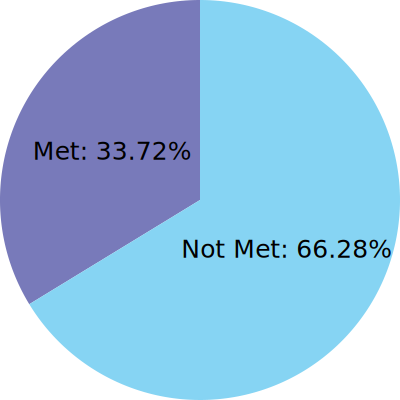
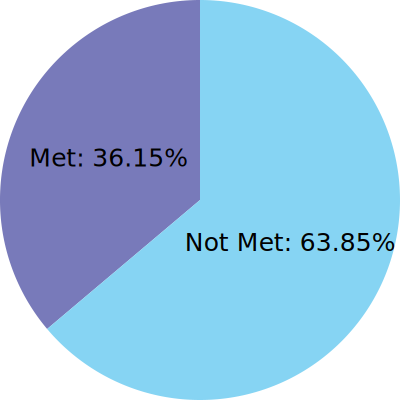
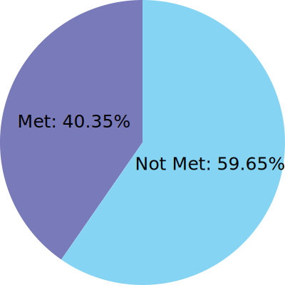

# Defense Unicorns Big Bang Distro (DUBBD) Compliance

## Compliance In A Half Shell
DUBBD utilizes OSCAL to map compliance frameworks controls to the tech stack. DUBBD uses an opinionated breakdown of controls that fall into one of three categories, Administrative (These controls can't be met by the tech stack IE creating an Access Policy), Technical (These controls are met by the tech stack), and Not Applicable (These controls could be met by a tech stack but do not align with our goal with DUBBD IE VOIP/Wireless Controls). The visuals below exclude Administrative and Not Applicable controls and focuses only on the Technical controls.

 

<table>
<tr>
<td>

## NIST 800-53 High

</td>
<td>

## NIST 800-53 Moderate

</td>
<td>

## NIST 800-53 Low

</td>
</tr>
</table>

 

## Control Family Breakdown

 

## Lists of Administrative and Not Applicable Controls

  
Administrative Controls

- AC-1
- AC-20
- AC-20(1)
- AC-20(2)
- AC-21
- AC-22
- AT-1
- AT-2
- AT-2(2)
- AT-2(3)
- AT-3
- AT-4
- AU-1
- CA-1
- CA-2
- CA-2(1)
- CA-2(2)
- CA-3
- CA-3(6)
- CA-5
- CA-6
- CA-7(1)
- CM-1
- CM-3
- CM-3(1)
- CM-3(4)
- CM-4
- CM-7(1)
- CM-9
- CM-10
- CM-12
- CP-1
- CP-2
- CP-2(1)
- CP-2(2)
- CP-2(3)
- CP-2(5)
- CP-2(8)
- CP-3
- CP-3(1)
- CP-4
- CP-4(1)
- CP-4(2)
- CP-6
- CP-6(1)
- CP-6(2)
- CP-6(3)
- CP-7
- CP-7(1)
- CP-7(2)
- CP-7(3)
- CP-7(4)
- CP-8
- CP-8(1)
- CP-8(2)
- CP-8(3)
- CP-8(4)
- IA-1
- IA-12
- IA-12(2)
- IA-12(3)
- IA-12(4)
- IA-12(5)
- IR-1
- IR-2
- IR-2(1)
- IR-2(2)
- IR-3
- IR-3(2)
- IR-4
- IR-4(11)
- IR-5
- IR-6
- IR-6(1)
- IR-6(3)
- IR-7
- IR-7(1)
- IR-8
- MA-1
- MA-2
- MA-2(2)
- MA-3
- MA-3(1)
- MA-3(2)
- MA-3(3)
- MA-4
- MA-4(3)
- MA-5
- MA-5(1)
- MA-6
- MP-1
- MP-3
- MP-4
- MP-5
- MP-6
- MP-6(1)
- MP-6(2)
- MP-6(3)
- MP-7
- PE-1
- PE-2
- PE-3
- PE-3(1)
- PE-4
- PE-5
- PE-6
- PE-6(1)
- PE-6(4)
- PE-8
- PE-8(1)
- PE-9
- PE-10
- PE-11
- PE-11(1)
- PE-12
- PE-13
- PE-13(1)
- PE-13(2)
- PE-14
- PE-15
- PE-15(1)
- PE-16
- PE-17
- PE-18
- PL-1
- PL-2
- PL-4
- PL-4(1)
- PL-8
- PS-1
- PS-2
- PS-3
- PS-4
- PS-4(2)
- PS-5
- PS-6
- PS-7
- PS-8
- PS-9
- RA-1
- RA-2
- RA-3
- RA-3(1)
- RA-7
- RA-9
- SA-1
- SA-2
- SA-3
- SA-4
- SA-4(1)
- SA-4(2)
- SA-4(5)
- SA-4(9)
- SA-4(10)
- SA-5
- SA-8
- SA-9
- SA-9(2)
- SA-15
- SA-15(3)
- SA-16
- SA-17
- SA-21
- SA-22
- SC-1
- SI-1
- SI-5
- SI-5(1)
- SI-6
- SI-12
- SR-1
- SR-2
- SR-2(1)
- SR-3
- SR-5
- SR-6
- SR-8
- SR-9
- SR-9(1)
- SR-10
- SR-11
- SR-11(1)
- SR-11(2)
- SR-12

  
Not Applicable Controls

- AC-14
- AC-18
- AC-18(1)
- AC-18(3)
- AC-18(4)
- AC-18(5)
- AC-19
- AC-19(5)
- CP-10
- CP-10(2)
- CP-10(4)
- SI-4(14)
- SI-8
- SI-8(2)

