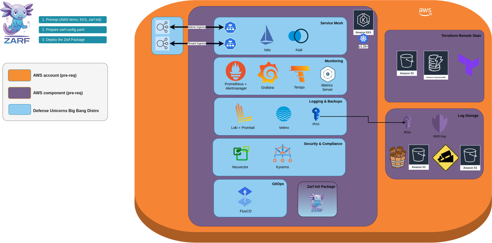

# Docs

## DUBBD AWS

### Components

DUBBD AWS deploys all of the core components from DUBBD along with several AWS specific components:
- EBS gp3 Storage Class for all DUBBD components (if EBS provider exists in cluster)
- ExternalDNS and Route53 IAM/IRSA to support access
- S3, KMS, and IAM/IRSA for Loki log storage
- Configurable public/private elastic load balancers for ingress

### Diagram

